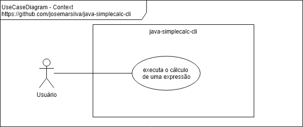
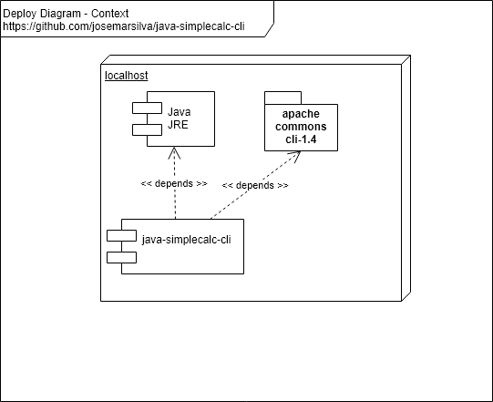
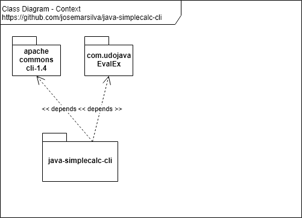

# README - java-simplecalc-cli
Java Simple Calculator - Command Line

## 1. Introduction

This is repository of the project **java-simplecalc-cli**.

## 2. Documentation

### 2.1. Use Case Diagram

 


### 2.2. Deploy Diagram

 


### 2.3. Packages and Class Class Diagram

 

### 2.4. Branch Strategy Workflow
Branch:
* `master`: pronto para produção
* `develop`: último desenvolvimento pronto para produção

Consulte todos detalhes da [estratégia de branches e workflow](https://github.com/josemarsilva/eval-git#38-estrat%C3%A9gia-de-gerenciamento-de-branches) deste projeto.


## 3. Project

### 3.1. Preconditions

* Java JDK 1.8 (jar file includes runnable)
* Eclipse (version Neon recommended)
* Apache Maven 3.6 (recommended > 3.3)
* `pom.xml`:
  * properties:
    * `<project.build.sourceEncoding>UTF-8</project.build.sourceEncoding>`
  * dependencies:
    * https://mvnrepository.com/artifact/commons-cli/commons-cli
	* https://mvnrepository.com/artifact/com.udojava/EvalEx
  * build:
    * `<finalName>java-simplecalc-cli</finalName>`
	* `<plugin> <artifactId>maven-assembly-plugin</artifactId> </plugin>`


### 3.2. Guide for Developers

* Clone source code using "git clone". Use branch "master" if branch "develop" is not available.
* Read, if avaliable, "2. Documentation"  and "3.X. Guides, Patterns, Standard, Conventions and Best Practices" to understand patterns, standards, conventions and best practices used in this project.
* Make your changes, commit and push on "develop" branch. Use branch "master" if branch "develop" is not available. Ask me permission, if not available permission to push.


### 3.3. Guide for Configuration

* n/a


### 3.4. Guide for Test

The following command line runs JUnit tests.

```bat
C:\..\java-simplecalc-cli> mvn clean test
```


### 3.5. Guide for Deploy

The following command line builds a runnable (.jar) in `.\target\java-simplecalc-cli-jar-with-dependencies.jar`

```bat
C:\..\java-simplecalc-cli> mvn clean compile package assembly:single
```


### 3.6. Guide for Demonstration

Some demonstrations examples:

* Evaluate expression: `1 + 1 = 2`
   
```bat
C:\..\java-simplecalc-cli> java -jar .\target\java-simplecalc-cli-jar-with-dependencies 1 + 1
2 
```

* Evaluate expression: `1 + 2 * 3 / 4 = 2.5`. We need to envolve with quotes " because of `*`

```bat
C:\..\java-simplecalc-cli> java -jar target\java-simplecalc-cli-jar-with-dependencies.jar "1 + 2 * 3 / 4"
2.5
```


### 3.7. Patterns, Standard, Conventions and Best Practices

* n/a


## I - References

* [How to write doc comment for JavaDoc Tool](https://www.oracle.com/technetwork/articles/javase/index-137868.html)
* [Apache Commons CLI usage](https://commons.apache.org/proper/commons-cli/usage.html)
* [Udo Java - Expression Evaluation](https://udojava.com/2012/12/16/java-expression-parser-evaluator/)
* [Maven](https://www.in28minutes.com/maven-tutorial-for-beginners)
* [Git Branching Model](https://nvie.com/posts/a-successful-git-branching-model/)
* [Git Numerosas possibilidades de defazer algo](https://docs.gitlab.com/ee/topics/git/numerous_undo_possibilities_in_git/#quickly-save-local-changes)
